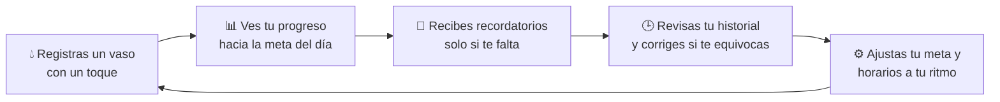

# 💧 AguaDiaria

**AguaDiaria** es una aplicación móvil para crear el hábito de tomar agua
todos los días. Está hecha con [Expo](https://expo.dev) y React Native
(TypeScript), guarda todo localmente en el dispositivo (`AsyncStorage`)
y te acompaña con recordatorios, estadísticas e historial — como una
verdadera app de hábitos saludables. 🌱

---

## ✨ ¿Por qué esta app?

Tomar suficiente agua es uno de los hábitos de salud más simples y, a la
vez, más fáciles de olvidar en el día a día. AguaDiaria existe para
resolver justo eso: **hacer visible tu progreso, recordarte a tiempo y
celebrar cada vaso que tomas**, sin pedirte cuentas ni conexión a internet.



Cada parte de la app responde a una necesidad concreta del hábito de
hidratarse:

| Parte | Para qué sirve | Por qué importa |
| --- | --- | --- |
| 💧 **Registro rápido** | Sumar agua con un toque desde la pantalla principal | Si registrar cuesta trabajo, el hábito se abandona — por eso es lo más simple e inmediato posible |
| 📊 **Progreso visual** | Un tanque animado que se llena hacia tu meta diaria | Ver el avance en tiempo real motiva a seguir, mucho más que un número suelto |
| 🔔 **Recordatorios inteligentes** | Notificaciones en la mañana, tarde y noche — solo si aún no llegaste a la meta | Evita interrupciones innecesarias: solo te avisa cuando de verdad te hace falta |
| 🕒 **Historial editable** | Consulta tus registros por día, con fecha y hora, y borra los que te equivocaste | Un hábito se sostiene si confías en tus datos; poder corregirlos es parte de eso |
| ⚙️ **Configuración a tu medida** | Cambia tu meta diaria, activa/desactiva avisos y ajusta sus horarios | Cada persona tiene rutinas distintas — la app debe adaptarse a ti, no al revés |
| 🎨 **Diseño cálido y animado** | Tarjetas redondeadas, degradados azules, ilustraciones de gotas y animaciones suaves | Una app de bienestar debe sentirse agradable de usar, no como una obligación más |

---

## 🧭 Navegación de la app

La app se organiza en **cuatro pestañas** accesibles desde la barra inferior:

```
┌─────────────────────────────────────────────────────────────┐
│   🏠 Inicio      📊 Estadísticas    🕒 Historial   ⚙️ Ajustes │
├─────────────────────────────────────────────────────────────┤
│  • Progreso del día   • Resumen semanal • Registros por  • Meta diaria │
│  • Botones rápidos    • Tendencias        fecha          • Notificaciones │
│  • Resumen del día    • Meta editable   • Eliminar       • Horarios   │
│                                            registros      • Borrar datos │
└─────────────────────────────────────────────────────────────┘
```

---

## 🛠️ Tecnologías

- **[Expo](https://expo.dev) SDK 56** + **React Native 0.85**
- **TypeScript**
- **`@react-native-async-storage/async-storage`** — persistencia local
- **`expo-notifications`** — recordatorios de hidratación
- **`expo-linear-gradient`** — degradados azul-blanco en toda la interfaz
- **`react-native-safe-area-context`** — diseño adaptado a cualquier pantalla

---

## 🚀 Empezar en desarrollo

### Requisitos

- [Node.js](https://nodejs.org/) 20 o superior
- [Expo Go](https://expo.dev/go) en tu celular (para probar sin compilar nada)
- Una cuenta gratuita en [expo.dev](https://expo.dev) (solo si vas a compilar con EAS)

### Instalación y ejecución

```bash
npm install
npx expo start
```

Esto abre Metro Bundler. Desde ahí puedes:

- Escanear el código QR con la app **Expo Go** en un celular Android o iOS
- Pulsar `a` para abrir un emulador de Android
- Pulsar `w` para abrir la versión web en el navegador

---

## 📁 Estructura del proyecto

```
App.tsx              Punto de entrada: maneja la navegación por pestañas
                     y comparte estado global (meta diaria, configuración)
src/
  components/        Piezas de UI reutilizables (tarjetas, botones, etc.)
  constants/         Colores, degradados y valores por defecto
  hooks/             Hooks de estado (meta diaria, configuración, recordatorios)
  screens/           Pantallas: Inicio, Estadísticas, Historial, Configuración
  services/          Notificaciones locales (expo-notifications)
  storage/           Persistencia con AsyncStorage
  types/             Tipos de TypeScript compartidos
  utils/             Funciones auxiliares (fechas, resúmenes diarios)
assets/              Ícono, splash screen e imágenes adaptativas de Android
```

---

## 📱 Compilar una app de Android (APK) con EAS Build

El proyecto ya incluye [`eas.json`](eas.json) con un perfil `preview` que
genera directamente un **APK** instalable (en lugar de un AAB para Play Store).

1. Inicia sesión con tu cuenta de Expo (crea una gratis en https://expo.dev si no tienes):

   ```bash
   npx eas-cli login
   ```

2. Vincula el proyecto a tu cuenta (solo la primera vez; genera un `projectId` y lo guarda en `app.json`):

   ```bash
   npx eas-cli init
   ```

3. Lanza la compilación en la nube (no necesitas Android Studio instalado):

   ```bash
   npx eas-cli build --platform android --profile preview
   ```

   Al terminar, EAS te da un enlace para descargar el `.apk` directamente
   a tu celular (o un código QR para escanear). Solo necesitas habilitar
   "Instalar apps de orígenes desconocidos" en Android para instalarlo.

4. Cuando quieras una versión final para subir a Google Play, usa el
   perfil `production` (genera un `.aab`):

   ```bash
   npx eas-cli build --platform android --profile production
   ```

---

## 🌐 Generar una versión web (para Netlify u otro hosting estático)

Expo puede exportar esta misma app como sitio web estático:

```bash
npx expo export --platform web
```

Esto genera la carpeta `dist/` lista para publicar. En Netlify:

- **Build command:** `npx expo export --platform web`
- **Publish directory:** `dist`

> ⚠️ Importante: la versión web es útil para mostrar o probar la interfaz
> desde un navegador, pero **no es la app real para celular**. Funciones
> que dependen de APIs nativas —como las notificaciones push de
> `expo-notifications`— no funcionan igual (o no funcionan) en la web.
> La app "de verdad", con notificaciones y guardado persistente en el
> dispositivo, es la que se instala como APK (compilada con EAS Build,
> ver arriba) o se prueba con Expo Go durante el desarrollo.

---

## 📜 Scripts disponibles

| Comando | Descripción |
| --- | --- |
| `npm start` | Inicia el servidor de desarrollo (Metro) |
| `npm run android` | Abre la app en un emulador/dispositivo Android |
| `npm run ios` | Abre la app en un simulador/dispositivo iOS |
| `npm run web` | Abre la versión web en el navegador |

---

## 📄 Licencia

Este proyecto se distribuye bajo los términos de [MIT License](LICENSE).
